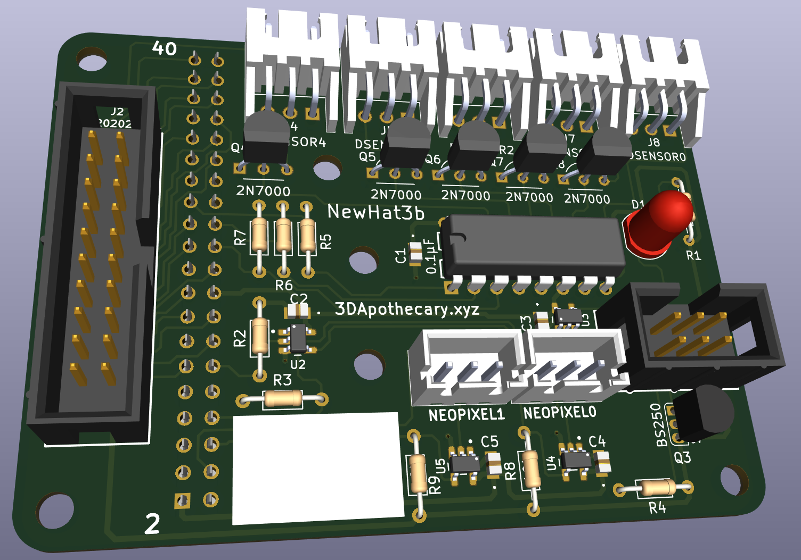
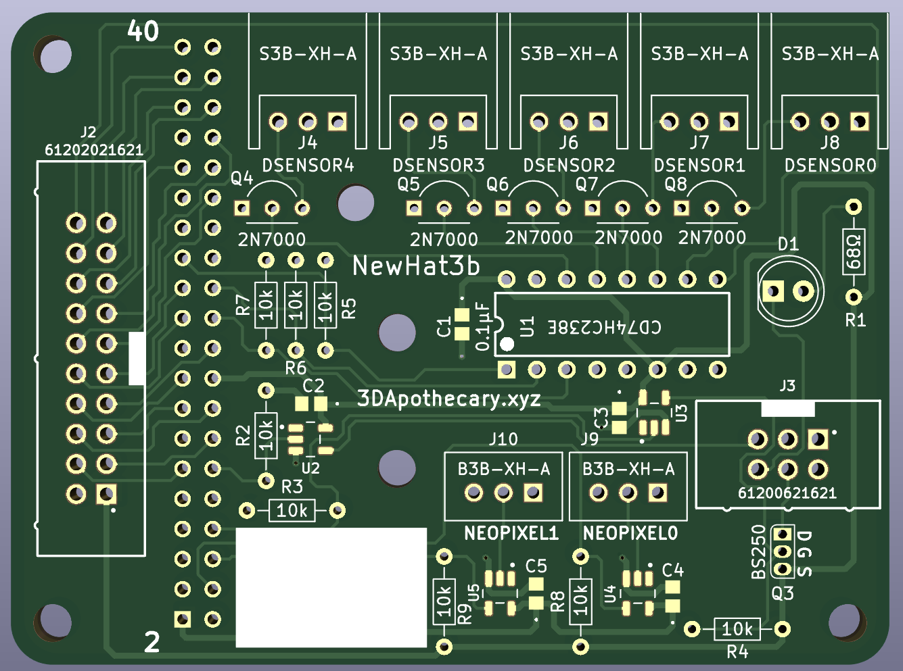

# NewHat3b Functional Test Interface Board

The NewHat3b board was designed for functionally testing 3DApothecary.xyz's [KGP 4x2209](https://github.com/3dApothecary-xyz/KGP_4x2209).  

Interfaces built into the PCB include:
* 40pin Raspberry Pi Socket
* 20pin HeaterBoardb Ribbon Cable Connector
* 5x 3pin JST XH 3D Printer Digital Sensor Input Test Connector
* 2x 3pin JST XH NewPixel Output Test Connector
* 6pin STM32 SWD Ribbon Cable Connector

Connector Information Presented On First Page of Schematics

[NewHat3b Schematics](schematic/NewHat3b_Schematics.pdf)

---

